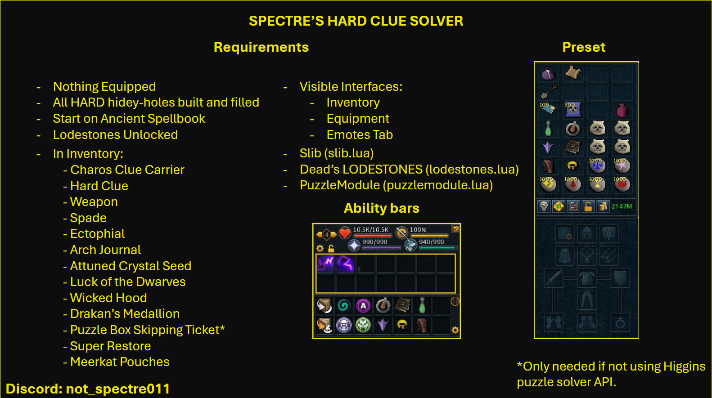

  

# 🧭 Spectre's Hard Clue Solver

A Lua automation script designed to solve **Hard Clue Scrolls** in RuneScape.

---

## ⚙️ Requirements

Before running the script, ensure the following setup:

### 🔓 General Setup
- All **Lodestones** unlocked  
- Start on **Ancient Spellbook**  
- **Inventory**, **Equipment**, and **Emotes** tabs visible  
- All **Hard Hidey Holes** built and filled  
- **No equipment** worn at startup  

---

## 📚 Required Libraries

Make sure these libraries are located in your `Lua_Scripts` directory:
  
- [Slib](https://github.com/spectre011-code/Public-ME-Scripts/blob/main/Libraries/slib.lua)
- [Dead Lodestones](https://me.deadcod.es/lodestones)
- [Higgins PuzzleModule](https://github.com/higgins-dotcom/lua-scripts/blob/main/Leagues/Clues/PuzzleModule.lua)

---

## 🧠 Ability Bars

### 🗡️ Combat Bar
- Any **Revolution (Revo)** bar suitable for combat

### ✨ Teleportation & Utility Bar
Include the following spells and items (ensure proper order if required by your setup):

- Lunar Book Swap  
- Western Kharazi Teleport  
- Annakarl Teleport  
- Drakan’s Medallion  
- Arch Journal  
- Ectophial  
- Standard Book Swap  
- Trollheim Teleport  
- Wars Retreat Teleport  
- Attuned Crystal Seed  
- Luck of the Dwarves  
- Wicked Hood  

---

## 🎒 Inventory Setup

Your inventory should contain the following items:

- Charos Clue Carrier  
- Hard Clue  
- Weapon  
- Spade  
- Ectophial  
- Arch Journal  
- Attuned Crystal Seed  
- Luck of the Dwarves  
- Wicked Hood  
- Drakan’s Medallion  
- Puzzle Box Skipping Ticket *(only needed if not using Higgins API solver)*  
- Super Restore  
- Meerkat Pouches  

### 🔮 Required Runes
- Cosmic  
- Astral  
- Blood  
- Law  
- Time  
- Fire  

---

## 🧩 Notes

- If you are not using the **Higgins API Puzzle Solver**, ensure you have enough **Puzzle Skipping Tickets**.
- If you are using the **Higgins API Puzzle Solver**, change the flag **UsePuzzleSolverAPI** to **true** and fill the **APIKey** with your token inside the **Spectre's Hard Clue Solver.lua** file.
- You can get your API Key in here: https://api.rs3bot.com/
- If you don’t want or are unable to complete a specific step, there is a `DestroyClue()` function that you can place instead of the solving code.
- This script assumes you can reach the step’s location — there are no checks for that.
- I encourage you to write different pathing for the steps and share them with the community. Tag if you need help with that.
- This script writes logs to file inside the `Lua_Scripts/logs` folder. If you want to disable it, change the flag **Slib._writeToFile** to **false** inside the **Spectre's Hard Clue Solver.lua** file.

---

## 💬 Credits

Developed by **Spectre**  
For RuneScape automation and Lua scripting enthusiasts.
