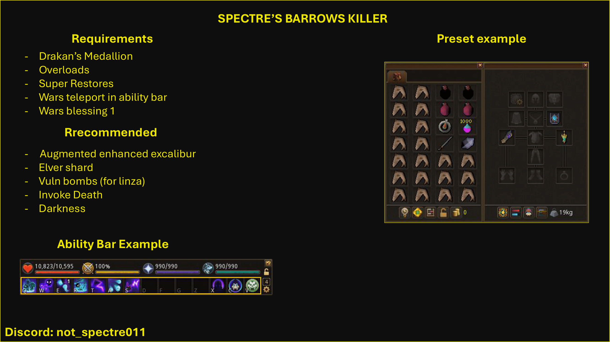

# Spectre's Barrows Killer

An automated Barrows combat script.

---

## 📌 Requirements

Before running the script, ensure you have **all** of the following:

- **War's Blessing 1**
- **Drakan's Medallion**
- **Overloads**
- **Super Restores**
- **Auto-retaliate enabled**
- **War's Retreat teleport** placed in the **ability bar**
- **Revolution++ enabled**

---

## 📚 Required Libraries

The following Lua libraries are mandatory for the script to function correctly:

- [Slib](https://github.com/spectre011-code/Public-ME-Scripts/blob/main/Libraries/slib.lua)
- [BANK](https://github.com/spectre011-code/Public-ME-Scripts/blob/main/Libraries/bank.lua)

---

## ✅ Recommended Setup

While not strictly required, the following will significantly improve performance and consistency:

- **Darkness** in the ability bar
- **Invoke Death** in the ability bar
- **Augmented Enhanced Excalibur**
- **Ancient Elven Ritual Shard**
- **Vulnerability bombs** (recommended for **Linza**)

---

## 📂 Installation

1. Download the repository or the **ZIP file**
2. Extract the contents
3. Place the `Barrows` folder inside your `Lua_Scripts` directory

Your final folder structure **must** look exactly like this:

```
MemoryError
└── Lua_Scripts
    └── Barrows
        └── Spectre's Barrows Killer.lua
```

---

## ▶️ Usage Notes

- Start at War's Retreat or Barrows
- Ensure Revolution++ and auto-retaliate are enabled **before** starting

---
