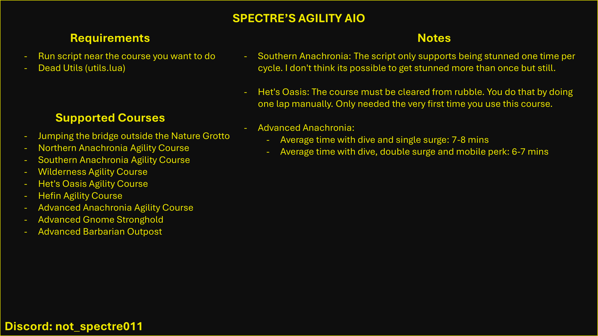

# Spectre's Agility AIO

[Dead Utils](https://me.deadcod.es/dead-utils)

## Supported Agility Courses

This script supports a wide range of agility courses, each optimized for specific level brackets. Below are the details and recommended levels for each course, along with the starting location for reference:

| Level Range | Course Description                                 | Starting Location |
|-------------|-----------------------------------------------------|-------------------|
| 1 - 30      | Jumping the bridge outside the Nature Grotto       | [View](https://imgur.com/a/Lj06Ook) |
| 30 - 50     | Northern Anachronia Agility Course                  | [View](https://imgur.com/a/kq80Zi2) |
| 50 - 52     | Southern Anachronia Agility Course                  | [View](https://imgur.com/a/giFrpEL) |
| 52 - 65     | Wilderness Agility Course                           | [View](https://imgur.com/a/43kKbVV) |
| 65 - 77     | Het's Oasis Agility Course                          | [View](https://imgur.com/a/hf1tboY) |
| 77 - 85     | Hefin Agility Course                                | [View](https://imgur.com/a/17zAd9a) |
| 85 - 99+    | Advanced Anachronia Agility Course                  | [View](https://imgur.com/a/qfrsup3) |
| -           | Advanced Gnome Stronghold                           | [View](https://imgur.com/a/lc6JMk5) |
| -           | Advanced Barbarian Outpost                          | [View](https://imgur.com/a/0tPR0Zf) |
